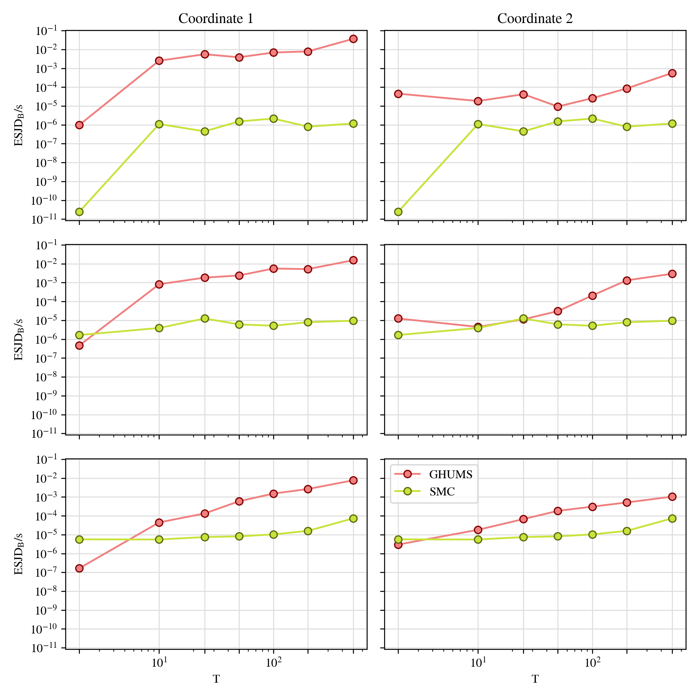

# Gaussian Constrained around Ellipsoid
Experiments about sampling from a Gaussian constrained to be around an ellipsoid

### T-vs-P trade-off
We fix a computational budget $NTP$ of $15$ million, where $N$ is the number of particles, $T$ is the number of integration steps and $P$ is the number of intermediary distributions. We fix the initial tolerance to $\epsilon_0=100.0$ and the final tolerance to $\epsilon_P=1e-5$. Initial particles are sampled from the prior, we fix $p_{\text{thug}} = 0.8$ and compute the Expected Squared Jump Distance (ESJD) divided by total runtime on the final target distribution. We compare values for $N=[100, 1000, 5000]$ and $T=[2, 10, 25, 50, 100, 200, 500]$. 

### Problem Description
Let $\upsilon$ be an isotropic Gaussian on $(\mathbb{R}^d, \mathcal{B}(\mathbb{R}^d))$. We wish to concentrate this distribution around an ellipsoid using a uniform kernel and sample from it. More precisely, given a tolerance $\epsilon > 0$, our target distribution is

$$
\mu_{\epsilon}(dx) \propto \mathbb{I}(\|f(x)\| \leq \epsilon) \mathcal{N}(dx\mid 0_d, I_d)
$$

where $\mathbb{I}$ is the indicator function, $f$ is a smooth map whose level sets are ellipsoid and, in particular $f^{-1}(0)$ is the ellipsoid of interest.  We call $f$ our constraint function and we define it as

$$
f(x) = \log\mathcal{N}(x \mid 0_d, \Sigma) - \log c,
$$

for a covariance matrix $\Sigma$ and a level set value $c > 0$. We target this distribution using [Integrator Snippets](https://arxiv.org/abs/2404.13302) and SMC samplers.